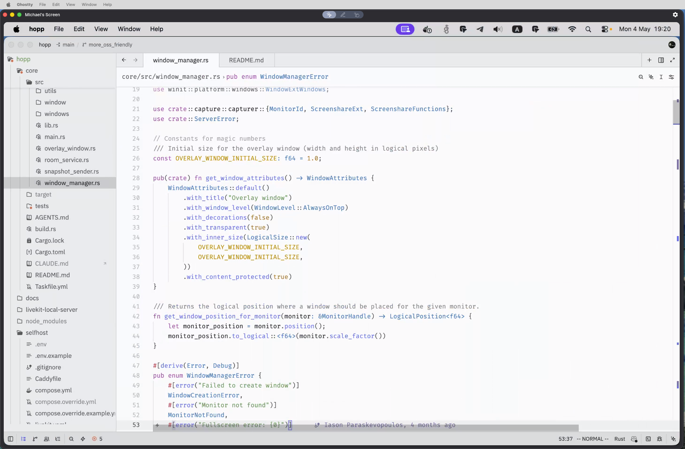

<div align="center">

# Hopp

Open source screen sharing built for developers. Pair program with sub-100ms latency. The OSS Tuple alternative.


[Website](https://gethopp.app) · [Download](https://github.com/gethopp/hopp/releases/latest) · [Sign up](https://gethopp.app) · [Docs](https://docs.gethopp.app) · [Self-host](#self-host) · [Discord](https://discord.gg/TKRpS3aMn9) · [Twitter](https://x.com/gethopp_app)

[](https://discord.gg/TKRpS3aMn9)
[](https://github.com/gethopp/hopp/blob/main/LICENSE.md)
![Powered by LiveKit](https://img.shields.io/badge/powered-by%20LiveKit-blue.svg?labelColor=212121&logo=data:image/svg%2bxml;base64,PHN2ZyB3aWR0aD0iMjQiIGhlaWdodD0iMjQiIHZpZXdCb3g9IjAgMCAyNCAyNCIgZmlsbD0ibm9uZSIgeG1sbnM9Imh0dHA6Ly93d3cudzMub3JnLzIwMDAvc3ZnIj4KPGcgY2xpcC1wYXRoPSJ1cmwoI2NsaXAwXzQyODRfMzM1ODUpIj4KPHBhdGggZD0iTTE0LjQwMDQgOS41OTk2MUg5LjU5OTYxVjE0LjQwMDRIMTQuNDAwNFY5LjU5OTYxWiIgZmlsbD0id2hpdGUiLz4KPHBhdGggZD0iTTE5LjIwMTEgNC44MDA3OEgxNC40MDA0VjkuNjAxNTNIMTkuMjAxMVY0LjgwMDc4WiIgZmlsbD0id2hpdGUiLz4KPHBhdGggZD0iTTE5LjIwMTEgMTQuNDAwNEgxNC40MDA0VjE5LjIwMTFIMTkuMjAxMVYxNC40MDA0WiIgZmlsbD0id2hpdGUiLz4KPHBhdGggZD0iTTI0IDBIMTkuMTk5MlY0LjgwMDc1SDI0VjBaIiBmaWxsPSJ3aGl0ZSIvPgo8cGF0aCBkPSJNMjQgMTkuMTk5MkgxOS4xOTkyVjI0SDI0VjE5LjE5OTJaIiBmaWxsPSJ3aGl0ZSIvPgo8cGF0aCBkPSJNNC44MDA3NSAxOS4xOTkyVjE0LjQwMDRWOS41OTk2MlY0LjgwMDc1VjBIMFY0LjgwMDc1VjkuNTk5NjJWMTQuNDAwNFYxOS4xOTkyVjI0SDQuODAwNzVIOS41OTk2M0gxNC40MDA0VjE5LjE5OTJIOS41OTk2M0g0LjgwMDc1WiIgZmlsbD0id2hpdGUiLz4KPC9nPgo8ZGVmcz4KPGNsaXBQYXRoIGlkPSJjbGlwMF80Mjg0XzMzNTg1Ij4KPHJlY3Qgd2lkdGg9IjI0IiBoZWlnaHQ9IjI0IiBmaWxsPSJ3aGl0ZSIvPgo8L2NsaXBQYXRoPgo8L2RlZnM+Cjwvc3ZnPgo=)
[](https://github.com/gethopp/hopp)
[](https://gethopp.app)

</div>

<p align="center">
  
</p>

<p align="center">
  
</p>

Hopp is an open source pair programming app and screen sharing tool built for developers. Whether you're looking for a Tuple alternative for remote pair programming, a self-hosted solution for your team, or an open source Pop / Drovio / Coscreen alternative — Hopp delivers sub-100ms latency with native desktop performance. Built on Tauri and Rust, with WebRTC infrastructure powered by [LiveKit](https://livekit.io).

## Try Hopp

1. **Download the desktop app** — [macOS (stable)](https://github.com/gethopp/hopp/releases/latest) or [Windows (alpha)](https://github.com/gethopp/hopp/releases/latest)
2. **Pick your backend**:
   - **Managed cloud** — [sign up at gethopp.app](https://gethopp.app) (14 days free trial) 
   - **Self-host** — run your own backend, no sign up needed, see [Self-host](#self-host) below
3. **Click your teammate and start pairing** — no link sharing, no setup

## Why Hopp

- ⚡ **Latency-tuned WebRTC** — [We optimised WebRTC](https://gethopp.app/blog/latency-exploration) for the best screen sharing experience
- 👥 **Mob programming up to 10** — join a room and start pairing instantly
- 🔗 **One-click pairing** — no more sharing links over chat
- 🖥️ **Native desktop** — Tauri + Rust, low CPU overhead
- 🪟 **Open source + self-hostable** — full source, run it on your own infra

## Self-host

```bash
git clone https://github.com/gethopp/hopp.git
cd hopp/selfhost
cp .env.example .env   # edit DOMAIN + secrets
docker compose up -d   # for localhost see full guide in selfhost/README.md
```

Includes Postgres, Redis, LiveKit, and Caddy auto-TLS. Full guide: [`selfhost/README.md`](./selfhost/README.md).

## Paid Cloud supports development

Hopp is independent and funded by Cloud subscribers. The managed plan at [gethopp.app](https://gethopp.app) gives you Hopp without the ops, and every subscription pays for further development of the OSS app you're reading about. If you can self-host, please do — and consider [starring the repo](https://github.com/gethopp/hopp) to help others find it.

## Supported Platforms

**macOS** (stable) · **Windows** (alpha) · **Linux** (planned)

## Roadmap

- [x] Move WebRTC from WebKit to Rust backend (in progress)
- [ ] Dynamic codec selection + adaptive streaming resolution
- [ ] Key bindings
- [ ] Linux support
- [ ] Windows full support

## Tech Stack

Desktop: Tauri (Rust) + React/TypeScript · Backend: Go + Postgres + LiveKit (WebRTC)

## 📚 Documentation

- [Official Documentation](https://docs.gethopp.app)
- [Core process docs](/core/README.md)
- [Local development guide](https://docs.gethopp.app/quick-start/local-development/prerequisites/)

## 🌐 Community & Support

- Join our [Discord community](https://discord.gg/TKRpS3aMn9)
- Follow us on [Twitter](https://x.com/gethopp_app)

---

⭐ **Star us if you'd like Hopp to keep growing!**

Licensed under [LICENSE.md](https://github.com/gethopp/hopp/blob/main/LICENSE.md).
